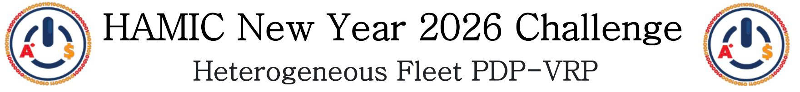
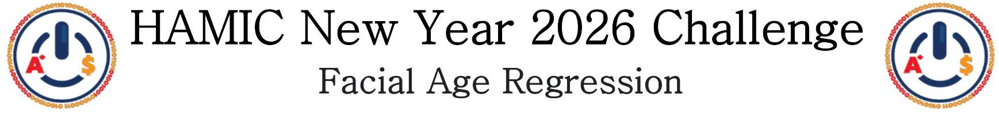
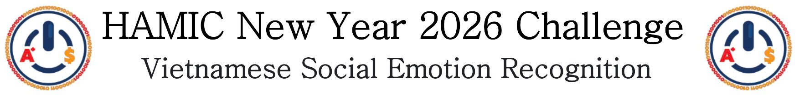

<div align="center">
  
</div>


# 🚀 Quick Start

| Task | Bài toán | Mô tả ngắn | Link tham gia |
| :--- | :--- | :--- | :--- |
| **🚚 ALGO** | **Heterogeneous Fleet PDP-VRP** | Tối ưu hóa lộ trình giao hàng với đội xe không đồng nhất. | [**Tham gia ngay**](https://www.kaggle.com/competitions/hamic-new-year-2026-algo-task) |
| **📷 CV** | **Facial Age Regression** | Ước lượng tuổi từ ảnh thực tế (in-the-wild). | [**Tham gia ngay**](https://www.kaggle.com/competitions/hamic-new-year-2026-cv-task) |
| **💬 NLP** | **Vietnamese Social Emotion Recognition** | Nhận diện 7 loại cảm xúc từ bình luận mạng xã hội. | [**Tham gia ngay**](https://www.kaggle.com/competitions/hamic-new-year-2026-nlp-task) |

---

# Nội dung
- [Tổng quan](#tổng-quan)
- [Mô tả bài toán](#mô-tả-bài-toán)
    - [ALGO Task](#algo-task-heterogeneous-fleet-pdp-vrp)
    - [CV Task](#cv-task-facial-age-regression)
    - [NLP Task](#nlp-task-vietnamese-social-emotion-recognition)
- [Starter Kit](#starter-kit)
- [Các mốc thời gian quan trọng](#các-mốc-thời-gian-quan-trọng)
- [Cách thức tham gia](#cách-thức-tham-gia)
- [Quy định cuộc thi](#quy-định-cuộc-thi)
- [Tài nguyên](#tài-nguyên)
- [Ban tổ chức](#ban-tổ-chức)

# Tổng quan

**HAMIC New Year 2026 Challenge** là thử thách thường niên nhằm tìm kiếm các giải pháp sáng tạo cho những bài toán thực tế trong lĩnh vực Trí tuệ nhân tạo và Thuật toán. Năm nay, thử thách tập trung vào ba bài toán cốt lõi: Tối ưu hóa vận chuyển (ALGO), Thị giác máy tính (CV), và Xử lý ngôn ngữ tự nhiên (NLP).

# Mô tả bài toán

## ALGO Task: Heterogeneous Fleet PDP-VRP
<div align="center">
  
</div>

Trong các hệ thống logistics và vận tải hiện đại, doanh nghiệp thường phải xử lý đồng thời nhiều đơn hàng với yêu cầu nhận và giao tại các vị trí khác nhau. Việc lập kế hoạch lộ trình hiệu quả cho đội xe, đặc biệt khi các phương tiện có tải trọng và chi phí vận hành khác nhau, là một bài toán tối ưu quan trọng trong lĩnh vực thuật toán và nghiên cứu vận trù học.

**Nhiệm vụ:**

Xây dựng thuật toán giải bài toán **Pickup & Delivery Problem với đội xe không đồng nhất (Heterogeneous Fleet PDP-VRP)**.

Mỗi đơn hàng bao gồm một điểm nhận (Pickup) và một điểm giao (Delivery). Thuật toán cần quyết định:
- Phân công đơn hàng cho xe phù hợp
- Xây dựng lộ trình di chuyển cho từng xe

Sao cho **tổng chi phí vận chuyển là tối ưu nhất**.

Bài toán thuộc nhóm **Combinatorial Optimization / Vehicle Routing Problem (VRP)** với các ràng buộc thực tế như tải trọng, thứ tự nhận-giao và tính nhất quán phương tiện.

### 1. Mô tả bài toán
#### Định nghĩa Bài toán

Bài toán thuộc lớp **Pickup & Delivery Problem with Heterogeneous Fleet (PDP-HF)**.

Hệ thống gồm các thành phần sau:

**a. Fleet (Đội xe)**

Tập xe $V = \{v_1, v_2, ..., v_m\}$

Mỗi xe $v$ có thuộc tính:

- $Capacity_v$ – Tải trọng tối đa  
- $Price_v$ – Chi phí trên mỗi đơn vị quãng đường  
- $Start_v = (x_v, y_v)$ – Tọa độ xuất phát  

**b. Orders (Đơn hàng)**

Tập đơn hàng $O = \{o_1, o_2, ..., o_n\}$

Mỗi đơn hàng $o_i$ có:

- $Weight_i$ – Khối lượng hàng  
- $Pickup_i = (p^x_i, p^y_i)$ – Điểm nhận  
- $Delivery_i = (d^x_i, d^y_i)$ – Điểm giao  

**c. Distance Function (Hàm khoảng cách)**

Khoảng cách Euclidean giữa hai điểm $A(x_1, y_1)$, $B(x_2, y_2)$:

$$
dist(A, B) = \sqrt{(x_1 - x_2)^2 + (y_1 - y_2)^2}
$$

#### Phát biểu Bài toán

Yêu cầu xây dựng lộ trình cho toàn bộ đội xe sao cho:

- Mỗi đơn hàng được phục vụ hợp lệ  
- Không vi phạm ràng buộc vận hành  
- Tổng chi phí nhỏ nhất  

Chi phí của một xe $v$:

$$
Cost_v = TotalDistance_v \times Price_v
$$

Tổng chi phí hệ thống:

$$
TotalCost = \sum_{v \in V} Cost_v
$$

Mục tiêu tối ưu:

$$
\min TotalCost
$$

#### Ràng buộc Bài toán (Constraints)

**a. Capacity Constraint**

Tại mọi bước trong lộ trình của xe, tải trọng không được vượt quá tải trọng tối đa:

$$
Load_v(k) \le Capacity_v
$$

Trong đó $k$ là thứ tự thao tác trong lộ trình của xe $v$.

**b. Pickup–Delivery Precedence**

Mỗi đơn hàng phải được nhận trước khi giao:

$$
Position(Pickup_i) < Position(Delivery_i)
$$

Trong đó $Position(\cdot)$ là chỉ số thao tác trong lộ trình.

**c. Completeness Constraint**

Mỗi đơn hàng phải được phục vụ đầy đủ:

$$
count(Pickup_i) = 1 \land count(Delivery_i) = 1
$$

**d. Ownership Constraint**

Đơn hàng không được trung chuyển giữa các xe.
Xe nào thực hiện Pickup của đơn hàng thì chính xe đó phải thực hiện Delivery.

$$
Vehicle(Pickup_i) = Vehicle(Delivery_i)
$$

**e. Load Consistency**

Tải trọng của xe phải được cập nhật chính xác sau mỗi thao tác.

- Sau Pickup: $Load \leftarrow Load + Weight_i$
- Sau Delivery: $Load \leftarrow Load - Weight_i$

Tại mọi thời điểm:

$$
Load_{v}(t) \ge 0
$$

Điều này đảm bảo xe không thể giao hàng khi không có hàng trên xe.

**f. Consistency Constraint**

Mọi tham chiếu trong file lời giải phải hợp lệ:

- $Vehicle_{ID} \in V_t$
- $Order_{ID} \in O_t$

Không được sử dụng ID không tồn tại trong Test Case tương ứng.

**g. Action Validity**

Các thao tác trên đơn hàng phải hợp lệ và không được mâu thuẫn logic.

Không được phép:

- Pickup trùng lặp cho cùng một Order
- Delivery trùng lặp cho cùng một Order
- Delivery khi chưa Pickup

#### Điều kiện nghiệm hợp lệ

Một nghiệm hợp lệ khi:

- Bao phủ toàn bộ tập $O$  
- Thỏa mãn mọi ràng buộc  
- Đúng định dạng Output


### 2. Dữ liệu

Dữ liệu bao gồm các phương tiện vận chuyển và các đơn hàng cần thực hiện.

Mỗi Test Case gồm hai thành phần chính:

**1. Vehicle (Đội xe)**
Mỗi phương tiện có các thuộc tính:
- `ID`: Định danh xe
- `Capacity`: Tải trọng tối đa
- `Price`: Đơn giá theo quãng đường
- `Start_X`, `Start_Y`: Tọa độ xuất phát

**2. Order (Đơn hàng)**
Mỗi đơn hàng bao gồm:
- `ID`: Định danh đơn hàng
- `Weight`: Khối lượng hàng hóa
- `Pickup_X`, `Pickup_Y`: Tọa độ nhận hàng
- `Delivery_X`, `Delivery_Y`: Tọa độ giao hàng

#### Đặc điểm dữ liệu

Bài toán mang tính tổ hợp và phản ánh các điều kiện vận tải thực tế:
- Đội xe **không đồng nhất** (khác tải trọng & chi phí)
- Mỗi đơn hàng có **hai điểm ràng buộc**: Pickup & Delivery
- Phân bố không gian theo tọa độ 2D (Euclidean space)
- Số lượng xe và đơn hàng thay đổi theo Test Case

### 3. Đánh giá
Kết quả được đánh giá bằng chỉ số **Mean Efficiency Score (MES)**

Với mỗi Test Case $t$:

- **Tổng chi phí thực tế**

$$
TotalCost_t =
\sum_{v \in V_t}
\big(
TotalDistance_{v,t} \times Price_v
\big)
$$

- **Cận dưới lý tưởng**

$$
LowerBound_t =
\sum_{i \in O_t}
\big(
dist(Pickup_i, Delivery_i) \times Price_{\min,t}
\big)
$$

Trong đó:

$$
Price_{\min,t} = \min_{v \in V_t}(Price_v)
$$

- **Efficiency Score của Test $t$**

$$
ES_t =
\frac{TotalCost_t}{LowerBound_t}
$$

**Mean Efficiency Score**

$$
MES =
\frac{1}{T}
\sum_{t=1}^{T} ES_t
$$

**Ký hiệu sử dụng**

- $V_t$ – Tập xe trong Test $t$  
- $O_t$ – Tập đơn hàng trong Test $t$  
- $TotalDistance_{v,t}$ – Tổng quãng đường xe $v$ di chuyển trong Test $t$  
- $Price_v$ – Đơn giá theo quãng đường của xe $v$  
- $Pickup_i$, $Delivery_i$ – Tọa độ Pickup và Delivery của Order $i$  
- $T$ – Số lượng Test Case  

Bảng xếp hạng sẽ được sắp xếp từ trên xuống dưới theo thứ tự tăng dần dựa trên **MES**

### 4. Quy cách nộp bài

File nộp bài phải ở định dạng CSV:
```
ID,Test,Vehicle_ID,Order_ID,Type,Stop_Order
1,1,V001,O001,Pickup,1
2,1,V001,O001,Delivery,2
3,2,V003,O010,Pickup,1
4,2,V003,O010,Delivery,2
```
**Quy tắc bắt buộc**
- Cột đầu tiên là số thứ tự của dòng (Bắt buộc của nền tảng Kaggle)
- Số lượng dòng (Không tính header) phải đúng bằng tổng số Order của tất cả các Test
- Không tham chiếu ID của Vehicle hoặc Order không tồn tại trong Test tương ứng
- Không vi phạm các ràng buộc

Submission sai định dạng sẽ không được chấm điểm.

### 5. Dataset Details
**Dữ liệu**

Ban tổ chức cung cấp một file dữ liệu đầu vào duy nhất:

- **input.txt** – Chứa toàn bộ Test Case của bài toán

File input bao gồm **nhiều Test Case độc lập**, được xử lý nối tiếp.

**Mô tả cấu trúc input.txt**

Mỗi Test Case mô tả một bài toán **Pickup & Delivery với đội xe không đồng nhất**.

**Cấu trúc tổng quát của mỗi Test Case:**

**Header Test**
```
Test <Test_ID>
```

**Danh sách Vehicle**
```
Vehicle
ID,Capacity,Price,Start_X,Start_Y
```

- `ID` – Định danh xe  
- `Capacity` – Tải trọng tối đa  
- `Price` – Đơn giá trên mỗi đơn vị khoảng cách  
- `Start_X`, `Start_Y` – Tọa độ xuất phát  

**Danh sách Order**
```
Order
ID,Weight,Pickup_X,Pickup_Y,Delivery_X,Delivery_Y
```

- `ID` – Định danh đơn hàng  
- `Weight` – Khối lượng đơn hàng  
- `Pickup_X`, `Pickup_Y` – Tọa độ nhận hàng  
- `Delivery_X`, `Delivery_Y` – Tọa độ giao hàng  

**Đặc điểm dữ liệu**

Dữ liệu phản ánh bối cảnh vận tải thực tế. Các Test Case có thể:

- Có số lượng xe và đơn hàng khác nhau  
- Có phân bố tải trọng và giá xe không đồng đều  
- Có vị trí hình học đa dạng  
- Không đảm bảo nghiệm tối ưu hiển nhiên  
- Hoàn toàn độc lập giữa các Test Case  

**Lưu ý quan trọng:**

- Mỗi Test Case phải được xử lý độc lập  
- Không được tham chiếu Vehicle / Order ngoài Test hiện tại  
- ID là khóa định danh duy nhất trong từng Test  

**Kết quả cần dự đoán**

Thí sinh cần xây dựng **lộ trình vận chuyển hợp lệ**:

- Gán đơn hàng cho xe  
- Xác định thứ tự Pickup / Delivery  

Bài toán thuộc nhóm **tối ưu tổ hợp (combinatorial optimization)**.

**Định dạng Submission**

File submission phải ở định dạng **CSV** với **chính xác sáu cột**:

`ID,Test,Vehicle_ID,Order_ID,Type,Stop_Order`

Trong đó:

- `ID` - Chỉ số dòng không tính Header (Bắt buộc của nền tảng Kaggle để không lỗi)
- `Test` – Test Case tương ứng  
- `Vehicle_ID` – Xe thực hiện hành động  
- `Order_ID` – Đơn hàng liên quan  
- `Type` – `Pickup` hoặc `Delivery`  
- `Stop_Order` - Thứ tự di chuyển của phương tiện `Vehicle_ID`

Ví dụ hợp lệ:
```
ID,Test,Vehicle_ID,Order_ID,Type,Stop_Order
1,1,V001,O001,Pickup,1
2,1,V001,O001,Delivery,2
3,2,V003,O010,Pickup,1
4,2,V003,O010,Delivery,2
```

**Quy tắc bắt buộc**
- Cột đầu tiên là số thứ tự của dòng (Bắt buộc của nền tảng Kaggle)
- Số lượng dòng (Không tính header) phải đúng bằng tổng số Order của tất cả các Test
- Không tham chiếu ID của Vehicle hoặc Order không tồn tại trong Test tương ứng 
- Mỗi Order phải được Pickup và Delivery đúng một lần  
- Pickup phải xảy ra trước Delivery  
- Xe Pickup phải là xe Delivery (không trung chuyển)  
- Không vi phạm Capacity tại bất kỳ thời điểm nào
- Không vi phạm các ràng buộc bài toán

**Ví dụ**

**Input (input.txt)**
```
Test 1
Vehicle
ID,Capacity,Price,Start_X,Start_Y
V001,100,10,0,0

Order
ID,Weight,Pickup_X,Pickup_Y,Delivery_X,Delivery_Y
O001,10,10,10,20,20
```

**Output (solution.csv)**
```
ID,Test,Vehicle_ID,Order_ID,Type,Stop_Order
1,1,V001,O001,Pickup,1
2,1,V001,O001,Delivery,2
```

---

## CV Task: Facial Age Regression
<div align="center">
  
</div>


Trong lĩnh vực Computer Vision, việc trích xuất thông tin nhân khẩu học từ ảnh khuôn mặt là một bài toán quan trọng với nhiều ứng dụng thực tế. Một trong những nhiệm vụ phổ biến và đầy thách thức là **ước lượng tuổi từ khuôn mặt trong điều kiện tự nhiên**.

Khả năng ước lượng tuổi tự động có ý nghĩa lớn trong nhiều hệ thống:

- Phân tích nhân khẩu học người dùng
- Cá nhân hóa nội dung & quảng cáo
- Hệ thống tương tác người – máy
- Nghiên cứu hành vi & thị giác máy tính
- Các ứng dụng an toàn & bảo mật

Trong cuộc thi này, nhiệm vụ của bạn là xây dựng mô hình **dự đoán tuổi từ ảnh khuôn mặt người**.

Mỗi ảnh được xem như một record độc lập. Mô hình cần ước lượng **tuổi của người xuất hiện trong ảnh** dựa hoàn toàn vào thông tin thị giác.

Bài toán thuộc dạng: **Age Regression** – mỗi ảnh tương ứng với một giá trị tuổi duy nhất.

### 1. Mô tả bài toán

#### Định nghĩa Bài toán

Bài toán thuộc lớp **Regression** trong lĩnh vực **Computer Vision**.

Xét không gian ảnh $\mathcal{X}$ và không gian giá trị tuổi $\mathcal{Y}$:

$$
\mathcal{Y} = \mathbb{R}^{+}
$$

Mỗi mẫu $x \in \mathcal{X}$ là một ảnh khuôn mặt người.

Mỗi ảnh tương ứng với **một giá trị tuổi duy nhất** $y \in \mathcal{Y}$.

#### Hàm dự đoán

Mô hình cần học một hàm ánh xạ:

$$
f : \mathcal{X} \rightarrow \mathcal{Y}
$$

Trong đó:

- Đầu vào là ảnh khuôn mặt  
- Đầu ra là tuổi ước lượng của người trong ảnh  

#### Phát biểu Bài toán

Yêu cầu xây dựng mô hình có khả năng ước lượng tuổi của người xuất hiện trong ảnh dựa hoàn toàn vào thông tin thị giác.

Đối với mỗi ảnh:

- Hệ thống phải dự đoán đúng một giá trị tuổi  
- Tuổi là biến liên tục, không phải nhãn rời rạc  

#### Đặc trưng Bài toán

Bài toán phản ánh các thách thức điển hình của dữ liệu ảnh thực tế:

- Đa dạng về điều kiện ánh sáng và góc chụp  
- Khác biệt về biểu cảm và đặc điểm khuôn mặt  
- Chất lượng ảnh không đồng nhất  
- Có thể xuất hiện nhiễu thị giác (blur, occlusion, low resolution)  

Đây là bài toán **noisy visual regression**.

#### Mục tiêu

Tối ưu mô hình hồi quy nhằm cực tiểu hóa sai số dự đoán tuổi:

$$
\min \mathcal{L}(f)
$$

Trong đó $f$ là hàm ánh xạ từ ảnh khuôn mặt sang giá trị tuổi dự đoán.

Hiệu năng mô hình được đánh giá bằng **RMSE**.

#### Điều kiện dự đoán hợp lệ

Một dự đoán hợp lệ khi:

- Giá trị dự đoán thuộc $\mathbb{R}^{+}$  
- Mỗi ảnh có đúng một giá trị tuổi  
- Không sinh giá trị không hợp lệ (âm, NaN, vô cực)  

### 2. Dữ liệu

Dữ liệu bao gồm các **ảnh khuôn mặt người** được gán nhãn tuổi.

Mỗi mẫu dữ liệu:
- `ID`: Định danh ảnh
- `Filename`: Tên file ảnh

Tập train có thêm:

- `Age`: Tuổi ground truth

#### Nhãn dự đoán

Bài toán yêu cầu mô hình dự đoán:

- `Age`: Tuổi của người trong ảnh

Lưu ý:

- Mỗi ảnh chỉ có một giá trị tuổi duy nhất
- `Age` là biến số liên tục (regression)

#### Đặc điểm dữ liệu

Ảnh trong dataset mang tính thực tế và có thể:
- Đa dạng về ánh sáng, góc chụp, biểu cảm
- Khác nhau về chất lượng và độ phân giải
- Có thể chứa nhiễu thị giác (blur, occlusion, low resolution)

### 3. Đánh giá
Kết quả được đánh giá bằng chỉ số **Root Mean Squared Error (RMSE)**.

$$
RMSE = \sqrt{\frac{1}{N} \sum_{i=1}^{N} (y_i - \hat{y}_i)^2}
$$

Trong đó:

- $N$: số lượng mẫu trong tập test  
- $y_i$: tuổi ground truth của mẫu thứ i  
- $\hat{y}_i$: tuổi mô hình dự đoán cho mẫu thứ i  

Bảng xếp hạng sẽ được sắp xếp từ trên xuống dưới theo thứ tự tăng dần dựa trên **RMSE**.

### 4. Quy cách nộp bài
File nộp bài phải ở định dạng CSV:
```
ID,Age
0001,23
0002,41
```

**Quy tắc bắt buộc**
- Không thay đổi ID
- Không thêm / bớt dòng
- Không duplicate ID
- Giá trị `Age` phải là số hợp lệ

Submission sai định dạng sẽ không được chấm điểm.

### 5. Dataset Details
**Dữ liệu**

Ban tổ chức cung cấp ba thành phần dữ liệu chính:
- **train.csv** – Tập huấn luyện (có nhãn)
- **test.csv** – Tập kiểm thử (không có nhãn)
- **images/** – Thư mục chứa toàn bộ file ảnh khuôn mặt

**Mô tả dữ liệu**

Mỗi mẫu dữ liệu tương ứng với một **ảnh khuôn mặt người**.

**Cấu trúc dữ liệu:**
- `ID` – Định danh duy nhất của ảnh
- `Filename` – Tên file ảnh, dùng để ánh xạ tới thư mục **images/**
- `Age` – Tuổi ground truth (chỉ có trong **train.csv**)

**Đặc điểm dữ liệu**

Ảnh trong dataset phản ánh nhiều điều kiện thực tế. Dữ liệu có thể:
- Được chụp dưới điều kiện ánh sáng khác nhau
- Bao gồm nhiều góc chụp và biểu cảm khuôn mặt
- Chứa nhiễu thị giác (blur, occlusion, low resolution)
- Có phân bố tuổi không đồng đều giữa các nhóm tuổi
- Không cung cấp metadata ngoài ảnh

**Lưu ý quan trọng:**
- Cột `Filename` chỉ chứa **tên file ảnh**
- File ảnh thực tế nằm trong thư mục **images/**
- Thí sinh cần tự đọc ảnh bằng cách kết hợp đường dẫn:
```
images/<Filename>
```
Ví dụ:
```
images/face_0001.jpg
```

**Nhãn dự đoán**

Bài toán yêu cầu dự đoán:
- **Age** – Tuổi của người trong ảnh

Đây là bài toán **regression**.
- Mỗi ảnh chỉ có **một giá trị tuổi duy nhất**

**Định dạng Submission**

File submission phải ở định dạng **CSV** với **chính xác hai cột**:

`ID,Age`

Ví dụ hợp lệ:
```
ID,Age
0001,23
0002,41
0003,35
```
**Quy tắc bắt buộc**

Submission hợp lệ cần thỏa mãn:
- Không thay đổi giá trị `ID`
- Không thiếu hoặc thừa dòng
- Không duplicate `ID`
- Giá trị `Age` phải là số hợp lệ

Submission sai định dạng sẽ **không được chấm điểm**.

Ví dụ

**Input (test.csv)**
```
ID,Filename
0001,face_0001.jpg
0002,face_0002.jpg
```

**Ảnh tương ứng**
```
images/face_0001.jpg
images/face_0002.jpg
```

**Output (submission.csv)**
```
ID,Age
0001,23
0002,41
```

---

## NLP Task: Vietnamese Social Emotion Recognition
<div align="center">
  
</div>

Trong thời đại mạng xã hội, mỗi ngày có hàng triệu comment được tạo ra, phản ánh cảm xúc và phản ứng của người dùng trước nội dung trực tuyến. Tự động nhận diện cảm xúc từ văn bản là một bài toán quan trọng trong Natural Language Processing (NLP).

**Nhiệm vụ:**

Xây dựng mô hình **phân loại cảm xúc** cho comment tiếng Việt.

Mỗi comment là một mẫu độc lập và chỉ mang **một nhãn cảm xúc duy nhất**.

Bài toán thuộc dạng **Multi-class Text Classification**.

### 1. Mô tả bài toán

#### Định nghĩa Bài toán

Bài toán thuộc lớp **Multi-class Text Classification** trong lĩnh vực **Natural Language Processing (NLP)**.

Xét không gian văn bản $\mathcal{X}$ và không gian nhãn cảm xúc $\mathcal{Y}$:

$$
\mathcal{Y} =
\{anger, disgust, enjoyment, fear, sadness, surprise, other\}
$$

Mỗi văn bản $x \in \mathcal{X}$ biểu diễn một comment tiếng Việt.

Mỗi comment chỉ được gán **một và chỉ một nhãn cảm xúc duy nhất** $y \in \mathcal{Y}$.

#### Hàm dự đoán

Mô hình cần học một hàm ánh xạ:

$$
f : \mathcal{X} \rightarrow \mathcal{Y}
$$

Trong đó:

- Đầu vào là nội dung văn bản  
- Đầu ra là một nhãn cảm xúc hợp lệ  

#### Phát biểu Bài toán

Yêu cầu xây dựng mô hình có khả năng tự động nhận diện cảm xúc của comment tiếng Việt dựa hoàn toàn vào nội dung văn bản.

Đối với mỗi comment:

- Hệ thống phải dự đoán đúng một nhãn cảm xúc  
- Không được sinh nhiều nhãn cho cùng một mẫu  

#### Đặc trưng Bài toán

Bài toán phản ánh các thách thức điển hình của văn bản mạng xã hội:

- Ngôn ngữ tự nhiên, không chuẩn hóa  
- Có thể chứa tiếng lóng, từ viết tắt  
- Có thể xuất hiện emoji hoặc ký tự đặc biệt  
- Có thể tồn tại lỗi chính tả  
- Cảm xúc có thể biểu đạt trực tiếp hoặc gián tiếp  

Bài toán thuộc nhóm **noisy multi-class classification**.

#### Mục tiêu

Tối ưu mô hình phân loại nhằm cực đại hóa chất lượng dự đoán:

$$
\max Performance(f)
$$

Hiệu năng được đánh giá bằng **Macro F1 Score**.

#### Điều kiện dự đoán hợp lệ

Một dự đoán hợp lệ khi:

- Nhãn dự đoán thuộc $\mathcal{Y}$  
- Mỗi comment có đúng một nhãn duy nhất  
- Không chứa nhãn ngoài tập cho phép  

### 2. Dữ liệu

Dữ liệu bao gồm các comment tiếng Việt được gán nhãn thủ công.

Mỗi mẫu dữ liệu:
- `ID`: Định danh comment
- `Sentence`: Nội dung comment

Tập train có thêm:
- `Emotion`: Nhãn cảm xúc 

#### Tập nhãn cảm xúc

Có 7 lớp cảm xúc:

- `anger` – tức giận, bực tức
- `disgust` – khó chịu mạnh, ghê tởm
- `enjoyment` – vui vẻ, tích cực
- `fear` – lo lắng, sợ hãi
- `sadness` – buồn bã, thất vọng
- `surprise` – ngạc nhiên
- `other` – trung tính hoặc cảm xúc khác

Lưu ý:

- Mỗi comment chỉ có một nhãn
- `other` bao gồm comment không biểu đạt cảm xúc rõ ràng

#### Đặc điểm dữ liệu

Comment mang tính tự nhiên và có thể chứa:
- Từ viết tắt / tiếng lóng
- Emoji / ký tự đặc biệt
- Lỗi chính tả
- Biểu đạt cảm xúc gián tiếp

### 3. Đánh giá
Kết quả được đánh giá bằng chỉ số **F1 Score (Macro F1)** với:
- **True Positive (TP)**: Dự đoán đúng nhãn đó.
- **False Positive (FP)**: Dự đoán là nhãn đó nhưng thực tế không phải.
- **False Negative (FN)**: Thực tế là nhãn đó nhưng mô hình không dự đoán đúng.
- **Precision**: Trong tất cả các comment mà mô hình dự đoán thuộc về 1 nhãn, có bao nhiêu comment thực sự đúng.

$$
Precision = \frac{TP}{TP + FP}
$$

- **Recall**: Trong tất cả các comment thực sự thuộc về 1 nhãn, mô hình nhận diện đúng được bao nhiêu.

$$
Recall = \frac{TP}{TP + FN}
$$

- **F1 Score**: cân bằng giữa Precision và Recall.

$$
F1 = \frac{2 \times Precision \times Recall}{Precision + Recall} = \frac{2TP}{2TP + FP + FN}
$$

- **Macro F1 Score**:

$$
Macro\ F1 = \frac{F1_{anger} + F1_{disgust} + F1_{enjoyment} + F1_{fear} + F1_{sadness} + F1_{surprise} + F1_{other}}{7}
$$

Bảng xếp hạng sẽ được sắp xếp từ trên xuống dưới theo thứ tự giảm dần dựa trên **Macro F1 Score**.

### 4. Quy cách nộp bài
File nộp bài phải ở định dạng CSV:
```
ID,Emotion
7567,other
3994,sadness
```

**Quy tắc bắt buộc**
- Không thay đổi ID
- Không thêm / bớt dòng
- Không duplicate ID
- Giá trị Emotion phải thuộc 7 nhãn hợp lệ

Submission sai định dạng sẽ không được chấm điểm.

### 5. Dataset Details
**Dữ liệu**
Ban tổ chức cung cấp hai thành phần dữ liệu chính:
- **train.csv** – Tập huấn luyện (có nhãn)
- **test.csv** – Tập kiểm thử (không có nhãn)

**Mô tả dữ liệu**

Mỗi mẫu dữ liệu tương ứng với một comment tiếng Việt được thu thập từ nền tảng mạng xã hội.

**Cấu trúc dữ liệu:**
- `ID` – Định danh duy nhất của comment
- `Sentence` – Nội dung comment dạng văn bản
- `Emotion` – Nhãn cảm xúc (chỉ có trong train.csv)

**Đặc điểm dữ liệu**

Comment trong dataset mang tính tự nhiên và phản ánh ngôn ngữ người dùng thực tế. Văn bản có thể:
- Gồm một hoặc nhiều câu
- Chứa từ viết tắt hoặc tiếng lóng
- Bao gồm emoji hoặc ký tự đặc biệt
- Có lỗi chính tả hoặc biến thể ngôn ngữ
- Thể hiện cảm xúc trực tiếp hoặc gián tiếp

**Tập nhãn cảm xúc**

Bài toán bao gồm **7 nhãn cảm xúc**:
- **anger** – Tức giận, bực tức
- **disgust** – Khó chịu, ghê tởm
- **enjoyment** – Vui vẻ, tích cực
- **fear** – Lo lắng, sợ hãi
- **sadness** – Buồn bã, thất vọng
- **surprise** – Ngạc nhiên, bất ngờ
- **other** – Trung tính hoặc cảm xúc khác

**Lưu ý**:

- Mỗi comment chỉ có **một nhãn duy nhất**
- Nhãn phải khớp **chính xác tuyệt đối** với tập hợp trên

**Định dạng Submission**

File submission phải ở định dạng **CSV** với **chính xác hai cột**:

`ID,Emotion`

Ví dụ hợp lệ:
```
"ID","Emotion"
"7567","other"
"3994","sadness"
"1023","enjoyment"
"8841","anger"
```

**Quy tắc bắt buộc**

Submission hợp lệ cần thỏa mãn:

- Không thay đổi giá trị `ID`
- Không thiếu hoặc thừa dòng
- Không duplicate `ID`
- Giá trị `Emotion` phải thuộc tập nhãn hợp lệ

Submission sai định dạng sẽ **không được chấm điểm**.

**Ví dụ**

**Input (test.csv)**
```
"ID","Sentence"
"7567","cũng do tụi online nổ nổ khoe khoe nữa i t ủng hộ 1 like tẩy chai hàng giả thu thuế"
"3994","con bé đáng thương"
```

**Output (submission.csv)**
```
"ID","Emotion"
"7567","other"
"3994","sadness"
```

# Starter Kit

Chúng tôi cung cấp **starter kit** cho từng bài toán để giúp người tham gia bắt đầu dễ dàng hơn. Mỗi starter kit bao gồm hướng dẫn chi tiết và notebook mẫu.

- **ALGO Task**: [`starter_kit/ALGO_Task/`](./starter_kit/ALGO_Task/)
- **CV Task**: [`starter_kit/CV_Task/`](./starter_kit/CV_Task/)
- **NLP Task**: [`starter_kit/NLP_Task/`](./starter_kit/NLP_Task/)

Ngoài ra, bạn có thể tham khảo **Script đánh giá** tại [`evaluation_script/`](./evaluation_script/) và **File nộp mẫu** tại [`sample_submission_files/`](./sample_submission_files/).

# Các mốc thời gian quan trọng

| Mô tả                         | Thời hạn               |
|-------------------------------|------------------------|
| Bắt đầu cuộc thi trên Kaggle                | 12h00 ngày 16/02/2026                 |
| Kết thúc cuộc thi trên Kaggle         | 23h59 ngày 30/03/2026                 |
| Công bố private leaderboard              | 12h00 ngày 31/03/2026                 |
| Hạn nộp báo cáo hệ thống (system paper)             | 23h59 ngày 30/04/2026                 |

# Cách thức tham gia

Cuộc thi được tổ chức trên nền tảng Kaggle. Thí sinh đăng ký tham gia tại các liên kết sau:

- **ALGO Task**: [https://www.kaggle.com/competitions/hamic-new-year-2026-algo-task](https://www.kaggle.com/competitions/hamic-new-year-2026-algo-task)
- **CV Task**: [https://www.kaggle.com/competitions/hamic-new-year-2026-cv-task](https://www.kaggle.com/competitions/hamic-new-year-2026-cv-task)
- **NLP Task**: [https://www.kaggle.com/competitions/hamic-new-year-2026-nlp-task](https://www.kaggle.com/competitions/hamic-new-year-2026-nlp-task)

## Định dạng nộp bài (Submission Format)

### ALGO Task (CSV)
```csv
ID,Test,Vehicle_ID,Order_ID,Type,Stop_Order
1,1,V001,O001,Pickup,1
2,1,V001,O001,Delivery,2
...
```
*Lưu ý: Không vi phạm các ràng buộc logic của bài toán VRP.*

### CV Task (CSV)
```csv
ID,Age
0001,23
0002,41
...
```
*Lưu ý: `Age` là số thực dương.*

### NLP Task (CSV)
```csv
ID,Emotion
7567,other
3994,sadness
...
```
*Lưu ý: `Emotion` phải thuộc tập nhãn hợp lệ (7 lớp).*

# Quy định cuộc thi

*Việc tham gia vào cuộc thi này đồng nghĩa với việc bạn đã đọc, hiểu và chấp nhận tuân thủ toàn bộ các quy định dưới đây. Các quy định này là thỏa thuận bắt buộc giữa đội thi và Ban Tổ Chức (BTC) cuộc thi HAMIC New Year 2026 Challenge.*

### 1. TỔNG QUAN VỀ CUỘC THI
* **Tên cuộc thi:** HAMIC New Year 2026 Challenge.
* **Mục tiêu:** Giải quyết bài toán Lập lịch vận chuyển tối ưu giao hàng tiếp vận.

### 2. ĐỐI TƯỢNG THAM GIA
* **Thí sinh hợp lệ:** Cuộc thi này dành cho tất cả mọi người đặc biệt cho các bạn thành viên CLB Toán Tin HAMIC. Mỗi thí sinh chỉ được phép sử dụng **01 tài khoản** nộp bài.
* **Xử lý vi phạm:** BTC có quyền hủy kết quả của bất kỳ tài khoản hoặc thí sinh nào nếu phát hiện gian lận.

### 3. QUY ĐỊNH VỀ DỮ LIỆU (DATA RULES)
#### A. Dữ liệu cuộc thi (Competition Data)
* **Mục đích sử dụng:** Thí sinh chỉ được phép truy cập và sử dụng dữ liệu do BTC cung cấp (Competition Data) cho mục đích duy nhất là tham gia cuộc thi này và thảo luận trên diễn đàn Kaggle của cuộc thi.
* **Bảo mật:** Nghiêm cấm mọi hành vi sao chép, phát tán, chia sẻ, bán hoặc chuyển nhượng dữ liệu cuộc thi cho bất kỳ bên thứ ba nào không tham gia cuộc thi.
* **Sau cuộc thi:** Thí sinh có trách nhiệm xóa dữ liệu nếu có yêu cầu từ BTC sau khi cuộc thi kết thúc.

#### B. Dữ liệu bên ngoài (External Data)
* **Quyền sử dụng:** Thí sinh **ĐƯỢC PHÉP** sử dụng dữ liệu bên ngoài (External Data) để cải thiện thuật toán.
* **Điều kiện:** Mọi nguồn dữ liệu bên ngoài được sử dụng phải là dữ liệu công khai (publicly available), hợp pháp và miễn phí để đảm bảo tính công bằng cho tất cả các đội thi.

### 4. QUY ĐỊNH VỀ NỘP BÀI & CHẤM ĐIỂM (SUBMISSION & SCORING)
#### A. Giới hạn nộp bài
* Mỗi đội được nộp tối đa **10 bài/ngày** (Submissions per day).
* Thí sinh được chọn tối đa **3 bài** (Final Submissions) để tính điểm xếp hạng cuối cùng (Private Leaderboard).

#### B. Đánh giá kết quả (Evaluation)
* **Thang đo:** Kết quả được đánh giá dựa trên chỉ số **MES**.
* **Bảng xếp hạng:** Kết quả được sắp xếp từ trên xuống dưới theo thang điểm của từng bài toán

### 5. QUY ĐỊNH VỀ MÃ NGUỒN (CODE SHARING)
* **Chia sẻ riêng tư:** Nghiêm cấm việc chia sẻ mã nguồn (code), notebook hoặc giải pháp giữa các thí sinh khác nhau trong thời gian diễn ra cuộc thi.
* **Notebook Public:** Thí sinh không được để chế độ Public cho các Notebook chứa giải pháp trực tiếp của cuộc thi trên Kaggle trong thời gian thi đấu.

### 6. LIÊM CHÍNH HỌC THUẬT
* Mỗi thí sinh chỉ được sử dụng một tài khoản Kaggle duy nhất.
* Nghiêm cấm các hành vi gian lận (cheating), dò đáp án (probing) hoặc can thiệp vào hệ thống chấm điểm.
* BTC giữ quyền quyết định cuối cùng trong mọi trường hợp tranh chấp hoặc phát hiện gian lận.

# Tài nguyên

- [Script đánh giá](./evaluation_script/README.md)
- [Thư mục dữ liệu](./task-dataset/)
- [Thư mục nộp mẫu (Sample Submission)](./sample_submission_files/)
- [Starter Kit (ALGO)](./starter_kit/ALGO_Task/)
- [Starter Kit (CV)](./starter_kit/CV_Task/)
- [Starter Kit (NLP)](./starter_kit/NLP_Task/)

# Ban tổ chức

- [Cao Hải An](https://github.com/HaianCao)

Liên hệ: [caohaian2005@gmail.com](mailto:caohaian2005@gmail.com)
